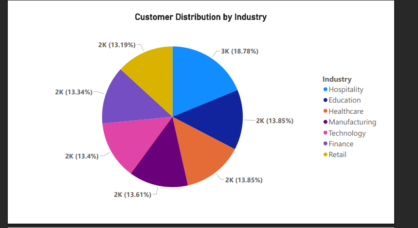
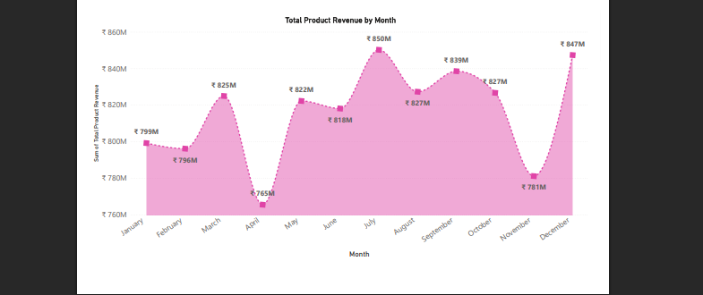

# 📊 A Comprehensive Data Analysis of Sales and Customer Trends

This project offers a deep dive into customer and sales performance through a structured data analytics process. The aim is to uncover meaningful business insights and drive data-driven decisions using Python, Excel, and Power BI.

---

## 🔍 Overview

- Conducted detailed **data preprocessing and cleaning** using **Excel** and **Pandas** to ensure data integrity and consistency.
- Performed **exploratory data analysis (EDA)** to uncover hidden patterns and eliminate noise.
- Designed an **interactive Power BI dashboard** to visualize KPIs such as revenue trends, customer segmentation, and sales performance.
- Focused on delivering insights to support **marketing strategies, product decisions, and operational efficiency**.

---

## 🛠️ Tools & Technologies Used

- **Languages & Libraries**: Python, Pandas, NumPy, Matplotlib  
- **Visualization**: Power BI  
- **Data Cleaning**: Excel, Pandas  
- **Notebook Environment**: Jupyter Notebook  

---

## 💡 Key Highlights

- 📌 Refined raw data by identifying and fixing anomalies, missing values, and duplicate records.
- 📈 Analyzed trends in customer behavior, sales volume, product category performance, and time-based revenue flow.
- 🔍 Identified key customer segments and product categories contributing to business growth.
- 📊 Developed visually appealing and dynamic **Power BI dashboards** with slicers, filters, and KPIs.
- 💼 Enabled **data-driven decision making** by showcasing actionable insights from the dashboard.

---

## 🚀 Outcome

- Delivered a robust and scalable analytical solution for understanding customer and sales trends.
- Improved business understanding through visual storytelling.
- Provided strategic recommendations to increase profitability and enhance customer satisfaction.

---

## 📷 Dashboard Preview

### 📌 Customer Distribution by Industry

### 📌 Total Product Revenue by Month

---
